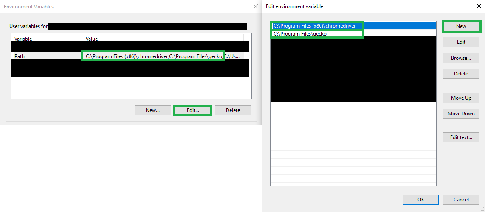

# Bought
A bot which can purchase items online, rendering them bought.

This bot is intended to combat scalping practices.

## Installation
Installing this bot is a multi-step process involving a Command Line
Interface (CLI) such as Windows PowerShell, Bash, Zsh, and Fish:
1. [Download Python](#1-downloading-python)
2. [Installing Bought](#2-installing-bought)
3. [Download browser drivers](#3-install-webdriver)

### 1. Downloading Python
Open up your respective CLI and type:
```
python --version
```
This will display the python version on your system. Ensure you are running
Python 3.7, or higher. If you are running an earlier version of Python,
please update your Python. If a Python version isn't installed on your
computer and you received an error running this command, download Python from
[Python.org](https://www.python.org/downloads/), or a Python distribution
like [Anaconda](https://www.anaconda.com/products/individual#Downloads).

### 2. Installing Bought
Python comes with its own package manager called `pip` which can install
packages/libraries. Upgrade the pip package using pip:
```
python -m pip install --upgrade pip
```
Now run the following to download this project package to your system's
Python:
```
pip install bought
```

### 3. Install Webdriver
Vist the [selenium documentation](https://selenium-python.readthedocs.io/installation.html#drivers)
page and download the driver for your preferred browser:
[Firefox](https://github.com/mozilla/geckodriver/releases) | [Chrome](https://sites.google.com/a/chromium.org/chromedriver/downloads)

This driver will need to be added to your PATH environment variable. You can do this on your specific OS as follows:

#### Windows Path
Press the Windows key, and type "environment":


Select the above item in the Control Panel, under the advanced tab, find
`Environment Variables...` in the bottom right corner.


Under User variables, select `Path`, `Edit...`, `New`, and provide the path to the driver you installed.




#### Linux/MacOS
In Linux and MacOS, your corresponding shell will have its own configuration
file (typically in your home folder). For bash and zsh, this is `~/.bashrc` and `~/.zshrc`, respectively.

Open the file and add the following line to the bottom:

```
export PATH=/path/to/driver:$PATH
```

Save and exit. You can restart the shell, or execute the source command for your corresponding configuration file:
```
source ~/.bashrc
source ~/.zshrc
etc...
```

## Usage
Bought uses Python's console scripts entry point. This allows you to use
the `bought` command from your CLI:

```
bought --help
```

This will display a list of subcommands and flags that can be used to
configure bought and run it from the command line; however, it is highly
recommended to use Bought with a config file:

```
bought -c config.ini
```

The config.ini file can be specified in any directory. A sample one is
provided in this repository with descriptive comments about their usage.

## Contributing
First and foremost, [create an
issue](https://github.com/boughts/bought/issues/new) on the github
repository. This is where issues can be made known publicly -- be sure to
check for duplicates prior to submitting an issue.

If you want to address an issue yourself, fork this repository, develop
your changes in a branch seperate from `main`, and submit a pull request.

This project uses [poetry](https://python-poetry.org/docs/#installation)
which allows for build isolation in a virtual environment. After downloading
the repository, run `poetry shell` and `poetry install` from the root of the
repository to install the project. You may need to uninstall the PyPI version
of `bought` with `pip uninstall bought` to use your own version of `bought`.